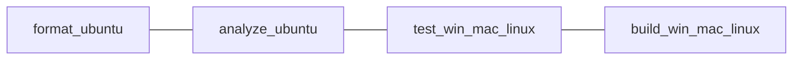

# Plan: split CI into format, analyze, test, and build

This plan extends [`.github/workflows/dart.yml`](../.github/workflows/dart.yml). It stays a proposal until that file is edited. Background on the current single job is in [workflows.md](workflows.md).

## Goal

Replace the one `build` job with four jobs that each do one thing:

| Job | Command | Runners |
| --- | --- | --- |
| `format` | `dart format --output=none --set-exit-if-changed .` | `ubuntu-latest` |
| `analyze` | `dart analyze --fatal-infos` | `ubuntu-latest` |
| `test` | `dart test` | `ubuntu-latest`, `windows-latest`, `macos-latest` |
| `build` | `dart build cli` | `ubuntu-latest`, `windows-latest`, `macos-latest` |

Format and analyze stay on Ubuntu. They use the Dart SDK and the analyzer, and their result does not depend on the host OS. Running them on three runners triples the cost and the flake surface without extra signal.

Test and build run on all three desktop operating systems. `fail-fast: false` stays, so a Windows failure still reports Linux and macOS.

The four jobs run in parallel. None of them `needs` another job. A format failure should still show test and build results on the same commit.



## Shared setup

Each job starts the same way:

1. `actions/checkout@v4`
2. `dart-lang/setup-dart` with `sdk` set explicitly
3. `dart pub get`

The current matrix key `dart: [stable]` is never passed into `setup-dart`. Wire it:

- On `format` and `analyze`, set `sdk: stable` (or `sdk: "3.13"` to track the minimum declared in [`pubspec.yaml`](../pubspec.yaml)).
- On `test` and `build`, keep a one-value matrix axis and pass it:

```yaml
strategy:
  fail-fast: false
  matrix:
    os: [ubuntu-latest, windows-latest, macos-latest]
    sdk: [stable]
runs-on: ${{ matrix.os }}
steps:
  - uses: actions/checkout@v4
  - uses: dart-lang/setup-dart@9a04e6d73cca37bd455e0608d7e5092f881fd603
    with:
      sdk: ${{ matrix.sdk }}
  - run: dart pub get
```

`stable` follows the newest stable SDK that still satisfies `sdk: ^3.13.4`. `"3.13"` installs the newest 3.13.x patch and matches the minimum constraint more tightly. Use one of those values in the required checks. A later scheduled `beta` run is described in [further_enhanced_workflow.md](further_enhanced_workflow.md), not in this split.

## Format

Ubuntu only.

```yaml
format:
  name: Format
  runs-on: ubuntu-latest
  steps:
    - uses: actions/checkout@v4
    - uses: dart-lang/setup-dart@9a04e6d73cca37bd455e0608d7e5092f881fd603
      with:
        sdk: stable
    - run: dart pub get
    - name: Verify formatting
      run: dart format --output=none --set-exit-if-changed .
```

`--output=none` prints the diff and does not rewrite the checkout. `--set-exit-if-changed` makes a dirty format a failed check.

`dart pub get` is required first so `dart format` can resolve the package config. Format itself does not need the downloaded packages to decide indentation, but the tool expects a resolved package root.

## Analyze (lint)

Ubuntu only. This is the lint job. [`analysis_options.yaml`](../analysis_options.yaml) already includes `package:lints/recommended.yaml`, so `dart analyze` is the lint runner. A separate `dart run custom_lint` step would only appear if the package later depended on `custom_lint`.

```yaml
analyze:
  name: Analyze
  runs-on: ubuntu-latest
  steps:
    - uses: actions/checkout@v4
    - uses: dart-lang/setup-dart@9a04e6d73cca37bd455e0608d7e5092f881fd603
      with:
        sdk: stable
    - run: dart pub get
    - name: Analyze project source
      run: dart analyze --fatal-infos
```

`--fatal-infos` keeps the current strictness: infos fail the job as well as warnings and errors.

## Test

```yaml
test:
  name: Test
  strategy:
    fail-fast: false
    matrix:
      os: [ubuntu-latest, windows-latest, macos-latest]
      sdk: [stable]
  runs-on: ${{ matrix.os }}
  steps:
    - uses: actions/checkout@v4
    - uses: dart-lang/setup-dart@9a04e6d73cca37bd455e0608d7e5092f881fd603
      with:
        sdk: ${{ matrix.sdk }}
    - run: dart pub get
    - name: Run tests
      run: dart test
```

Suites live under `test/` and use `package:test`. Keep `dart test` (this package is not Flutter).

## Build

Compile on the same three operating systems. Use `dart build cli`, which has been stable since Dart 3.9 and matches the bundle already present on a developer machine at `build/cli/windows_x64/bundle/bin/ascii_renderer.exe`.

`dart build cli` compiles for the runner it is invoked on. The Ubuntu runner produces a Linux x64 bundle, `windows-latest` produces Windows x64, and `macos-latest` is Apple silicon, so that runner produces a macOS arm64 bundle. Output lands under `build/cli/<target>/bundle/`, where `<target>` looks like `linux_x64`, `windows_x64`, or `macos_arm64`.

```yaml
build:
  name: Build
  strategy:
    fail-fast: false
    matrix:
      os: [ubuntu-latest, windows-latest, macos-latest]
      sdk: [stable]
  runs-on: ${{ matrix.os }}
  steps:
    - uses: actions/checkout@v4
    - uses: dart-lang/setup-dart@9a04e6d73cca37bd455e0608d7e5092f881fd603
      with:
        sdk: ${{ matrix.sdk }}
    - run: dart pub get
    - name: Build CLI bundle
      run: dart build cli
    - name: Upload CLI bundle
      uses: actions/upload-artifact@v4
      with:
        name: cli-${{ matrix.os }}
        path: build/cli/
        retention-days: 7
        if-no-files-found: error
```

Short retention keeps pull-request artifacts available for download without storing them for the default 90 days. `if-no-files-found: error` turns an empty `build/cli/` directory into a failed job.

`dart compile exe bin/ascii_renderer.dart -o ascii_renderer` remains the single-file alternative. Use it when the package has no `hook/build.dart`. If a build hook is added later, `dart compile exe` skips hooks and fails; `dart build cli` runs them and is the command to keep. This package has no hook today, so either command compiles. Prefer `dart build cli` so the reference pipeline matches the layout Dart uses for `dart install`.

A smoke run of the compiled binary waits until `font/iosevka.png` is in the repo. The entrypoint loads that file and exits when `input.jpg` is missing. Compilation itself does not need those files.

## Deployment targets for this CLI

Windows, macOS, and Linux are the deployment targets. WASM, web, Android, and iOS do not belong in this workflow.

The program is a native CLI. [`bin/ascii_renderer.dart`](../bin/ascii_renderer.dart) imports `dart:io` and reads and writes local files. The compilers below target different platforms, and those platforms do not host this program.

### WASM

`dart compile wasm` emits a WebAssembly GC module plus a source map. That output targets JavaScript hosts (browsers) that support WasmGC. It does not support `dart:io`. The Dart team also documents that this output does not run on standard Wasm runtimes such as wasmtime or wasmer, so it is not a WASI command-line target. Leave WASM out of CI and out of releases.

### Web

`dart compile js` emits JavaScript for a browser app, usually driven by `webdev` rather than by the compiler directly. Browser JavaScript cannot import `dart:io`. A web deployment would be a separate UI package with its own entrypoint. It is not a target of `ascii_renderer`.

### Android and iOS

`dart compile exe` and `dart build cli` produce executables for Windows, macOS, and Linux. Cross-compilation from `dart compile exe` is Linux-only. From any 64-bit host, the supported Linux architectures are:

- `x64`
- `arm64`
- `arm`
- `riscv64`

Flags: `--target-os=linux` and `--target-arch=<arch>`. There is no `--target-os=android` or `--target-os=ios` on these commands. Android and iOS apps are built with Flutter, or with a custom Dart embedder. GitHub-hosted runners used here do not produce an APK or IPA from this package.

### Optional architectures, later

These are extra native targets. They are not part of the first split, and they do not replace the three OS jobs above.

| Target | How | When it is worth adding |
| --- | --- | --- |
| Linux ARM64, ARM, RISC-V 64 | `dart compile exe --target-os=linux --target-arch=...` on the Ubuntu job | You want release archives for those machines. Cross-compiled binaries are not executed in CI unless a matching runner exists. |
| Windows ARM64 | `windows-11-arm` runner, if the account can use it | You ship Windows on Arm. `windows-latest` remains the x64 build. |
| macOS x64 | An Intel macOS runner | You still ship Intel Macs. `macos-latest` is Apple silicon, so its artifact is arm64. |

## Apply order

1. Add `format`, `analyze`, `test`, and `build` as above.
2. Delete the old combined `build` job so format and analyze are not still multiplied by the OS matrix.
3. Mark the four job names as required status checks, replacing the single `build` check.
4. Confirm one pull request: format fails on a bad edit, analyze fails on a lint, tests run on three OS rows, and each OS uploads a `build/cli/` artifact.
