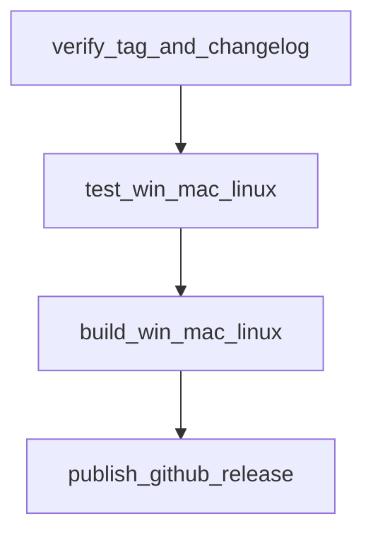

# Plan: release workflow

This plan adds [`.github/workflows/release.yml`](../.github/workflows/release.yml). The file is not created by this document. CI on pull requests stays in [`.github/workflows/dart.yml`](../.github/workflows/dart.yml), as described in [enhanced_workflow.md](enhanced_workflow.md).

The release publishes native CLI bundles for Windows, macOS, and Linux. WASM, web, Android, and iOS stay out of this workflow for the reasons in the enhanced-workflow plan.

## When it runs

Publish on a version tag, not on every push to `main`.

```yaml
name: Release

on:
  push:
    tags:
      - "v*.*.*"
  workflow_dispatch:
    inputs:
      tag:
        description: Existing tag to release, including the leading v
        required: true
        type: string
```

`v1.2.3` matches. `v1.2.3-beta.1` does not match `v*.*.*` and will not publish. Add a second tag pattern only when pre-releases are an explicit product decision. `workflow_dispatch` rebuilds an existing tag (for example after a failed publish) and must not invent a version that was never tagged.

Resolve the tag once and pass it as a job output:

- On `push`, use `github.ref_name` (`v1.0.0`).
- On `workflow_dispatch`, use `inputs.tag`.

Strip the leading `v` to get the pubspec version (`1.0.0`).

## Permissions

Default the workflow to read-only. Grant write only on the job that creates the GitHub Release.

```yaml
permissions:
  contents: read
```

The publish job overrides that with `permissions: contents: write`. `GITHUB_TOKEN` is enough to create a release in this repository. No extra secret is required for an unsigned release.

## Jobs



Tests finish before any compile is uploaded. The publish job runs only after every OS build has succeeded.

### verify

Runner: `ubuntu-latest`.

1. Check out the tag (`actions/checkout` with `ref` set to the tag on `workflow_dispatch`).
2. Read `version:` from [`pubspec.yaml`](../pubspec.yaml). Fail if it differs from the tag with the leading `v` removed. Today's package version is `1.0.0`, so the matching tag is `v1.0.0`.
3. Fail if [`CHANGELOG.md`](../CHANGELOG.md) has no heading `## <version>`. The current changelog heading is `## 1.0.0`.

This job is the gate that keeps a tag, the package version, and the changelog on the same number.

### test

Same operating systems as CI: `ubuntu-latest`, `windows-latest`, `macos-latest`, `fail-fast: false`.

Preferred shape, once `dart.yml` exposes `workflow_call`: call the CI test workflow and `needs: verify`. Until then, duplicate the test steps:

1. `dart-lang/setup-dart` with `sdk: stable` (or `3.13`, the same value CI requires).
2. `dart pub get`
3. `dart test`

Do not skip tests because the pull request already passed. The tag may contain commits that never had a green pull request.

### build

`needs: test`. Matrix, `fail-fast: false`:

| Runner | `dart build cli` target | Archive |
| --- | --- | --- |
| `ubuntu-latest` | Linux x64 (`build/cli/linux_x64/bundle/`) | `ascii_renderer-<version>-linux-x64.tar.gz` |
| `macos-latest` | macOS arm64 (`build/cli/macos_arm64/bundle/`) | `ascii_renderer-<version>-macos-arm64.tar.gz` |
| `windows-latest` | Windows x64 (`build/cli/windows_x64/bundle/`) | `ascii_renderer-<version>-windows-x64.zip` |

`<version>` is the pubspec version without a leading `v`. `macos-latest` is Apple silicon, so the macOS archive is arm64.

Package the `bundle/` directory, which contains `bin/` and any assets the build copied. On Windows, `Compress-Archive` the bundle contents into the zip. On Linux and macOS, `tar -czf` the bundle. Upload each archive with `actions/upload-artifact` (`retention-days: 1` is enough, because the GitHub Release is the durable copy). `if-no-files-found: error`.

`dart build cli` is the command to use. It matches the local bundle layout and runs build hooks if a later change adds `hook/build.dart`. `dart compile exe` produces one file and skips hooks; keep it as a fallback only while the package has no hooks.

### publish

`needs: build`. Runner: `ubuntu-latest`. `permissions: contents: write`.

1. Download every archive with `actions/download-artifact`.
2. Write `SHA256SUMS` next to the archives (`sha256sum` on Ubuntu).
3. Extract the changelog section for this version: the lines under `## <version>` up to the next `## ` heading. That text is the release body. [`CHANGELOG.md`](../CHANGELOG.md) is the source of notes; do not hand-write them in the workflow.
4. Create the GitHub Release with `softprops/action-gh-release`, pinned to a commit SHA with a version comment, the same pinning rule as in [further_enhanced_workflow.md](further_enhanced_workflow.md).

```yaml
- uses: softprops/action-gh-release@<commit-sha> # <tag>
  with:
    tag_name: ${{ needs.verify.outputs.tag }}
    name: ${{ needs.verify.outputs.tag }}
    body: ${{ steps.notes.outputs.body }}
    files: |
      dist/*.tar.gz
      dist/*.zip
      dist/SHA256SUMS
    fail_on_unmatched_files: true
```

`fail_on_unmatched_files: true` makes a missing archive a failed release. Set `draft: true` for the first trial tag if you want to inspect assets before the release is public, then switch drafts off once the job is trusted.

If the tag already has a release (a re-run via `workflow_dispatch`), let the action update that release and replace the assets.

## Version checklist before tagging

1. Set `version:` in [`pubspec.yaml`](../pubspec.yaml).
2. Add `## <version>` to [`CHANGELOG.md`](../CHANGELOG.md) with the user-facing notes.
3. Merge to `main`.
4. Tag `v<version>` on that commit and push the tag.

Pushing the tag is the only publish trigger. Deleting a tag does not delete the GitHub Release; remove the release in the GitHub UI if a tag was pushed by mistake.

## Out of scope for the first `release.yml`

**pub.dev.** `dart pub publish` is a second channel. It needs `repository` (still commented out in the pubspec), a `LICENSE`, and the `executables` map from [further_enhanced_workflow.md](further_enhanced_workflow.md). Users who `dart install` the package compile on their own machine. That path does not attach Windows, macOS, and Linux binaries to a GitHub Release, so it does not replace this workflow.

**Apple notarization and Windows Authenticode.** `dart compile exe` output can be signed, and a `dart build cli` bundle can be signed the same way, but both need certificates stored as repository secrets. Ship unsigned archives first. Add signing as a later build step: `codesign` plus `notarytool` on the macOS job, `signtool` on the Windows job. Notarization also needs an Apple ID, app-specific password, and team ID.

**Extra Linux architectures.** Linux ARM64 and RISC-V 64 can be cross-compiled from the Ubuntu job with `dart compile exe --target-os=linux --target-arch=arm64` (and `riscv64`). Add them as extra archives only. They do not replace the native x64 Linux build, and CI will not execute those binaries unless a matching runner is added. Windows ARM64 waits on a `windows-11-arm` runner. macOS x64 waits on an Intel macOS runner.

## First implementation order

1. Land the CI job split so `dart test` and `dart build cli` are already green on three operating systems.
2. Add `release.yml` with `verify`, `test`, `build`, and `publish`.
3. Push a trial tag as a draft release and download each archive.
4. Confirm `SHA256SUMS` matches the downloaded files.
5. Turn drafts off, then require the release workflow on tag pushes.
